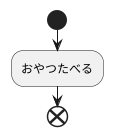

# 1. インストール

VS CODEの絹拡張で以下をインストールする

* PlantUML
* Markdown Preview Enhanced

PlantUMLを使うには、Javaが必要なので、Javaをインストールしておく。

# 2. 使い方

「@startuml」と「@enduml」の間に内容を記述する。 「Alt+D」で表示する。

## 2-1.トラブルシュート

### 2-1-1. 赤！　有効なダイアグラムが見つかりません

以下のサイトの対応を行ったが改善されず。
https://qiita.com/zonbitamago/items/7946acfb4cbaa139f00a

時々表示されたり、表示されなかったりで動作が不安定。

拡張子が「.md」だとうまく判定されない模様。
単純なUMLだけのファイルでもうまくいかない。拡張子を「puml」にすれば大丈夫だった。

# 3. UMLの書き方

## 3-1.アクティビティ図

フローチャートを発展させた形

### 3-1-1.書き方

先頭に:、末尾に;

例

aaa
