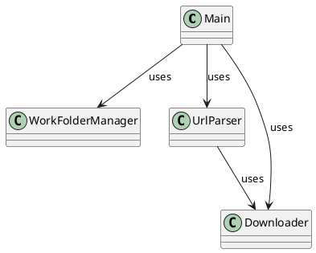

# 画像ダウンロード単純クラス図

メインクラス Main
作業フォルダ管理クラス WorkFolderManager
URL 解析クラス UrlParser
ダウンロードクラス Downloader

```plantuml
@startuml
class Main
class WorkFolderManager
class UrlParser
class Downloader

Main --> WorkFolderManager : uses
Main --> UrlParser : uses
Main --> Downloader : uses
UrlParser --> Downloader : uses
@enduml
```
