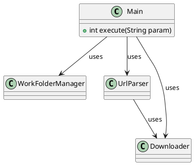

# 画像ダウンロードクラス図

## メインクラス Main

### execute

実際の処理、戻り値 int
各クラスを呼び出して処理する

## 作業フォルダ管理クラス WorkFolderManager

### parse

URL 文字列を受け取り、作成するフォルダ名を判断する。

### create_dir

フォルダを作成する、既に存在する場合はエラーにするか指定可能とする
作成したフォルダパスを返す

## URL 解析クラス UrlParser

BeautifulSoup を使用する

### download

Downloader を使用して HTML ドキュメントを取得する

### parse

Selenium を使用してデータを取得する
https://qiita.com/tomomi-kawashita/items/1a1e03d5ee590823b92e

ダウンロードクラス Downloader

